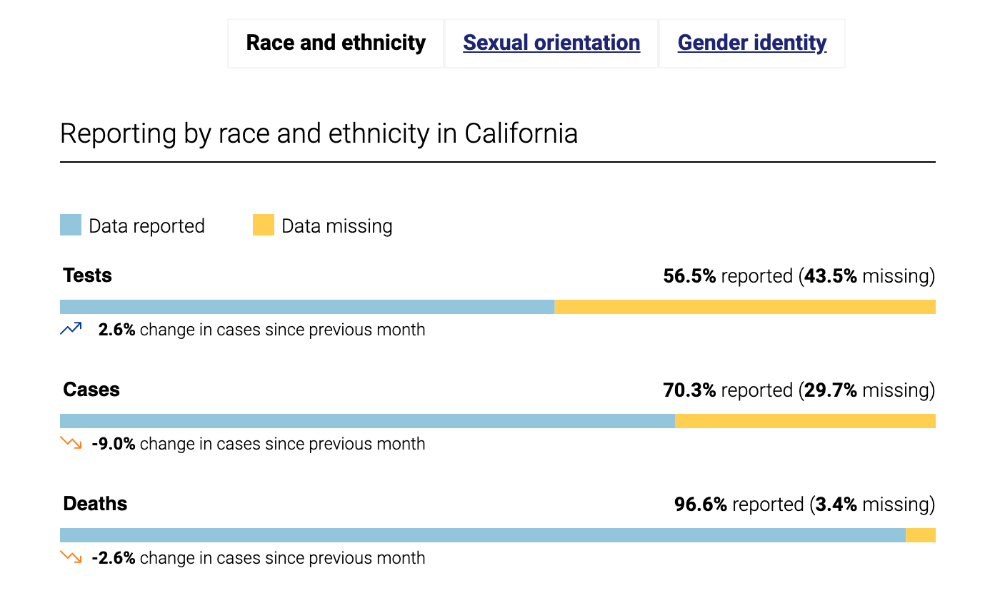

# CovidEquityStats - JavaScript

This service retrieves information to power the covid19 equity dashboard: <a href="https://covid19.ca.gov/equity/">covid19.ca.gov/equity/</a>. It queries snowflake and writes retrieved data as static json files to the cagov/covid-static repo.


## Approvals

- Data is retrieved from snowflake
- Data is not published before the statewide coordinated stats release time 9:30am Friday
- Data is published as static json files to the covid-static-data repository and from there pushed to files.covid19.ca.gov
- Data will be initially published as an open pull request on the static repository. 
- Data consumed by charts in staging is written into the /to-review folder. 
  - A PR is created and merged immediately for these json files.
- Data consumed by charts in production is read from the /reviewed folder. 
  - A PR with the daily data is created for this folder but not merged automatically. 
  - A primary and backup scientist are added as reviewers to the daily PR.
  - Instructions on the PR include links to the url of the page in staging where the information about to be merged is used so the charts can be browsed
  - A slack message is also sent to the covid-equity channel with a 5 minute delay to notify people the latest data is available for review in staging and the PR can be approved at will for use in production. The delay is meant to give the covid-static repo time to deploy the staging files just merged and for the short CDN cache on files.covid19 to expire.
  - The reviewers can merge the PR if the data is acceptable
- FYI there is a 10 minute CDN cache on files deployed to files.covid19.ca.gov. The publishing flow does not yet invalidate this cache.
- Data available on files.covid19.ca.gov is consumed by the charts on covid19.ca.gov pages with client side code and in the case of top box stats by the 11ty static site pregeneration build service to create the page HTML.


## Schedule

The timing that this function runs is controlled by the cron syntax in the <a href="function.json">function.json</a> file. The function as a service runs on GMT.

## Queries

The SQL used by this service is imported at the top of the <a href="index.js">index.js</a> file from the ../common/SQL/Equity folder in this repository

## Data validation

The structure of the data retrieved from snowflake is verified by tests referenced in this function's <a href="worker.js">worker.js file</a> imported from the ../common/SQL/Equity/schema folder in this repository.


## Example chart

### Snowflake query

SQL queries made against snowflake tables are in the index.js file. Several queries are made to retrieve the data for the charts, there is little modification done to the data by this service, it relies on snowflake as the trusted data source and packages up the results into small json files for the fastest consumption by the charts which make client side requests for the relevant json files. An example snowflake SQL query is: 

```
select COUNTY, METRIC, MISSING, NOT_MISSING, TOTAL, PERCENT_COMPLETE, PERCENT_COMPLETE_30_DAYS_PRIOR, PERCENT_COMPLETE_30_DAYS_DIFF, REPORT_DATE from PRODUCTION.VW_CDPH_DEMOGRAPHIC_COMPLETENESS where REPORT_DATE = (select max(REPORT_DATE) from PRODUCTION.VW_CDPH_DEMOGRAPHIC_COMPLETENESS)
```

The covid19.ca.gov web team receives snowflake data support in this case from Triston Mosbacher who was responsible for aggregating all the data queried here and wrote services to feed it into snowflake regularly. The views, fields and queries used in this service are created per Triston's advice.

### Chart

The missingness chart that uses the data above is:



The frontend code in each environment uses a config parameter defined during the site build process which identifies the url the charts should query to retrieve their data. This url is defined in the <a href="https://github.com/cagov/covid19/blob/master/src/js/equity-dash/rollup.config.js">equity dash js bundle rollup file</a>. The build parameters are environment variables passed into the run scripts in ```package.json``` and these build commands are used in the yml workflow scripts that create each environments codebase during the git action run.


