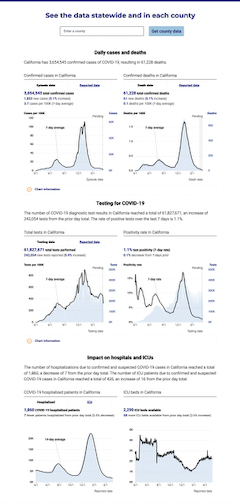

# Date pipeline for covid19.ca.gov state dashboard

This service is used to retrieve data to populate the hospital-related charts on the <a href="https://covid19.ca.gov/state-dashboard/">state dashboard</a>

- Data is retrieved from snowflake
- Data is not published before the statewide coordinated daily stats release time 9:30am daily
- Data is published as static json files to the covid-static-data repository and from there pushed to files.covid19.ca.gov
- Data will be initially published as an open pull request on the static repository. 
- Data publishing can be stopped by applying a "do not publish" label to the pull request
- Data publishing can be resumed by applying a "Publish ASAP" label. The presence of this label will allow the cronjob that runs every few minutes to merge the pull request. To publish immediately you could also manually merge the pull request.

- FYI there is a 10 minute CDN cache on files deployed to files.covid19.ca.gov. The publishing flow does not yet invalidate this cache.
- Data available on files.covid19.ca.gov is consumed by the charts on covid19.ca.gov pages with client side code and in the case of top box stats by the 11ty static site pregeneration build service to create the page HTML.

## Examples of data in use

- <a href="https://covid19.ca.gov/state-dashboard/">covid19.ca.gov state dashboard</a>

## Schedule

The timing that this function runs is controlled by the cron syntax in the <a href="function.json">function.json</a> file. The function as a service runs on GMT.

## Queries

The SQL used by this service is imported at the top of the <a href="index.js">index.js</a> file from the ../common/SQL folder in this repository

## Data validation

The structure of the data retrieved from snowflake is verified by tests referenced in this function's <a href="worker.js">worker.js file</a> imported from the ../SQL/CDT_COVID/CovidStateDashboardTables/schema folder in this repository.